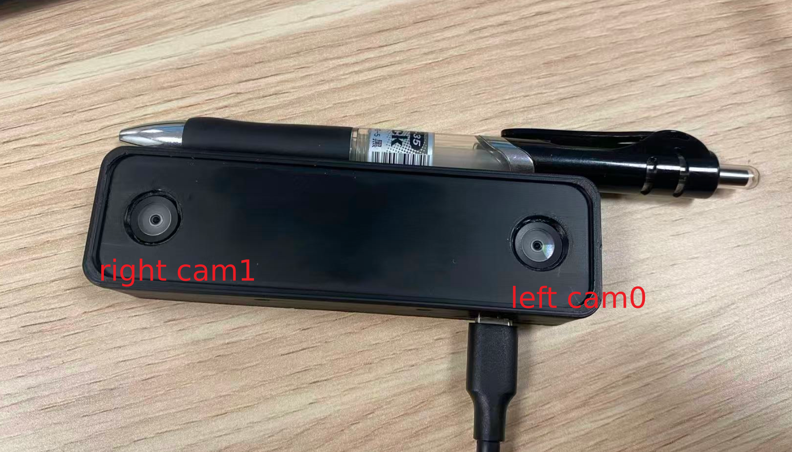
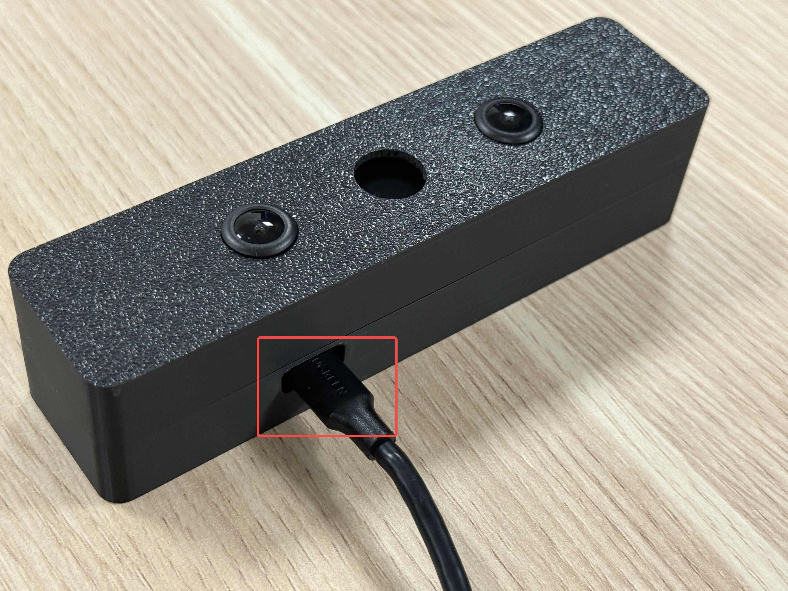
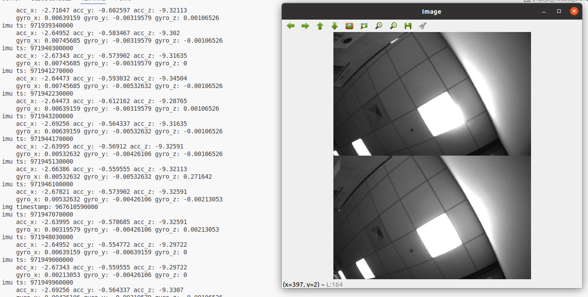

### News / Events
* 11月5日, 2025 - 修复[scripts] ROS中BUG(V2.1.4).
* 11月20日, 2025 - 增加[lib]双目相机**初始曝光**与**增益**的自动/手动切换控制(V2.2.0).请参考配置文件说明.
* 11月21日, 2025 - 增加[lib]双目相机左右分别旋转功能(V2.3.0).详见配置文件说明.
* 12月4日, 2025 - 增加[lib]支持RGB图像0/180度旋转,修复初始化双目相机BUG(V2.4.0).更新[ROS]优化ROS示例代码.
* 12月27日, 2025 - 修复[lib] BUG(V2.5.0).
* 12月31日, 2025 - 增加[lib] 双彩色模组支持(V2.6.1).
* 1月19日, 2026 - 增加[lib] 回调函数接口, 增加回调函数示例程序(V2.7.0).

### 支持平台
| 操作系统 | 架构   | 要求                  |
| :------- | :----- | :-------------------- |
| Linux    | x64    | Ubuntu 20.04 |
| Linux    | Arm64  | Ubuntu 20.04 |

**注:** 
* 当前版本支持的Arm平台：`RK3588(arm64)`,其他Arm系统可能需要重新编译，请联系客服。
* 如果示例代码中打印出来的“Fays ViKit Version”低于2.0.0，请用git checkout v1.0.0命令切换至匹配的版本。

### 快速开始
#### 获取SDK
```
git clone https://cnb.cool/FaysTech/FaysSenseRelease/FaysSense_VI_Kit_Release.git
```
#### 安装驱动(仅需在第一次使用时执行)
```
cd scripts
sudo ./setup.sh
./setup_ftdi_permissions.sh
```

#### 连接设备
* 请使用USB3.0 Type-C数据线连接相机和主机USB3.0接口。注意：**相机Type-C接口有正反之分**。如果读取不到图像，建议尝试反插数据线。
* 相机定义：typeC口朝下、相机朝前看，左手侧相机定义为左相机（cam0）,右手侧相机定义为右相机（cam1），中间相机为cam2。出厂标定时均使用正向图片进行标定。如果您拿到的相机对应图像为倒置图像，可在配置中进行修改（`left_cam_rotate_180`和`right_cam_rotate_180`）。





### 示例
以下指令均默认在本目录(FaysSense_VI_Module_Release)下执行，示例代码位于example目录下
#### 编译
**C++**
```
cd scripts && ./build.sh && cd .. 
```
**ROS1**
```
cd scripts && ./build_ros.sh && cd ..
```

#### 相机连接检测
```
cd scripts && ./connect_check.sh && cd ..
```
如果输出“相机已连接在USB3.0接口”，则表示相机连接正常，否则按照脚本提示的进行连接排查

#### 更改配置文件
```
./scripts/extract.sh
```
将输出的端口号复制到config/fays_vikit.yaml中对应的字段，注意重力加速度值更改为所在地的重力加速度值.

**配置说明：**
1. 通过修改 `fays_vikit.yaml` 配置文件的 `stereo_init_exposure` 和 `stereo_gain_value` 参数值实现双目相机**初始曝光**与**增益**的自动/手动切换。
2. 如遇左右目图像倒置,请修改`left_cam_rotate_180`和`right_cam_rotate_180`的值.
3. VIKit Pro可修改`rgb_rotate`的值来旋转RGB图像.
4. 如果您采购的是**双彩色模组**，`stereo_color_mode`配置为`1`则SDK出图模式为BGR8，如果配置为`0`，则出图模式为RAW。目前双彩色相机仅支持1280 * 800分辨率，请修改相关配置（`stereo_single_cam_width`和`stereo_single_cam_height`）。

#### 运行示例代码

* 注意设备权限更改
```
sudo chmod 777 /dev/video*
```
**C++**
本项目提供了一个C++示例程序用于录制相机数据。
```
cd scripts
./run_fays_record.sh
```
**ROS1**
本项目提供了两个ROS示例程序，用于演示通过SDK获取数据的不同使用方式。
1. 该示例通过在循环中主动调用SDK来获取数据.
```
// 请在另一终端启动roscore
cd scripts
./bringup_ros.sh
```
2. 该示例通过注册回调函数的方式获取数据.
```
// 请在另一终端启动roscore
cd scripts
./bringup_ros_callback.sh
```

* 程序在运行之后3秒左右会出现图像画面



**退出程序**
在运行的终端中输入q/Q后回车结束程序

**Note**
```
/**
 * 参数范围:
 * - Stereo Exposure: 1.0 ~ 507.0
 * - Stereo Gain: 1.0 ~ 15.0
 * - Stereo Resolution: 640*400*2 / 1280*800*2
 * - Stereo FPS: 1 ~ 70[640*400*2] / 1 ~ 45[1280*800*2]
 * - Rgb Exposure: 8.0 ~ 2146.0
 * - Rgb Gain: 1.0 ~ 72.0
 *
 * 注意:
 * - 当前仅支持通过 root 权限设置相机参数。
 */
```